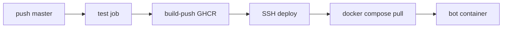

# Sushkabot — Deployment

Ops runbook extracted from product spec. Product behavior: [`SPEC.md`](SPEC.md).

## Pipeline



### Workflows

| Workflow | Trigger | Jobs |
|----------|---------|------|
| [`ci.yml`](../.github/workflows/ci.yml) | PR | lint, typecheck, test |
| [`deploy.yml`](../.github/workflows/deploy.yml) | push `master` | test → build-push → deploy |

**GHCR tags:** `ghcr.io/<owner>/sushkabot:latest` and `:sha-<7-char-commit>`

## VPS layout

```
~/sushkabot/             # VPS_INSTALL_DIR — owned by deploy user
├── .env                 # BOT_TOKEN, ADMIN_USER_IDS, GHCR_IMAGE, IMAGE_TAG, DATABASE_PATH, OPENAI_* (optional)
├── data/                # SQLite volume mount → /app/data in container
├── backups/
└── app/                 # git clone; docker-compose.yml lives here
```

Compose ([`docker-compose.yml`](../docker-compose.yml)):

- `image: ${GHCR_IMAGE}:${IMAGE_TAG}` — no `build:` on server
- `env_file: ${ENV_FILE}` — set `export ENV_FILE=~/sushkabot/.env` before compose
- `volumes: ${DATA_DIR}:/app/data` — set `export DATA_DIR=~/sushkabot/data`
- Run from `~/sushkabot/app`: `docker compose --env-file "$ENV_FILE" ...`

One-time bootstrap (as deploy user, no sudo):

1. [`deploy/setup-repo-ssh.sh`](../deploy/setup-repo-ssh.sh) — RSA deploy key + `Host github-sushkabot` in `~/.ssh/config`; add public key as repo **Deploy key** (read-only).
2. [`deploy/bootstrap-vps.sh`](../deploy/bootstrap-vps.sh) — clone via `git@github-sushkabot:owner/sushkabot.git`.

Deploy user must be in `docker` group (one-time `usermod` as root). GitHub Actions uses a separate `VPS_SSH_KEY` to SSH into the VPS.

## GitHub secrets

| Secret | Purpose |
|--------|---------|
| `VPS_HOST` | Server address |
| `VPS_PORT` | SSH port — optional, default `22` (Actions → VPS only) |
| `VPS_USER` | SSH user (non-root deploy user) |
| `VPS_SSH_KEY` | Private key |
| `VPS_INSTALL_DIR` | Optional — default `~/sushkabot` |
| `GHCR_READ_TOKEN` | Optional — classic PAT with `read:packages` if GHCR package is private |

`GITHUB_TOKEN` pushes images during `build-push` (no extra secret for push).

## Rollback and backups

**Rollback:** set `IMAGE_TAG=sha-<older>` in `~/sushkabot/.env`, then `docker compose --env-file ... pull && up -d`.

**Backup:** copy `~/sushkabot/data/sushkabot.db` to `backups/` (daily cron recommended).

**Restore:** stop container, replace DB file, start container. Migrations re-run idempotently on start.

**Deploy note:** Migrations run inside container on `src/index.ts` boot — no separate migrate step on VPS.

## Container build

- [`Dockerfile`](../Dockerfile) — `oven/bun:1.2`, `pnpm typecheck` at build
- [`.dockerignore`](../.dockerignore) — excludes `node_modules`, `.env*`, `data/`, tests

Testing and local dev: [`README.md`](../README.md).
