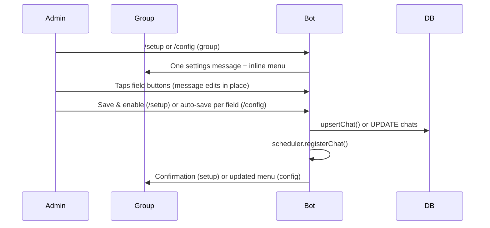
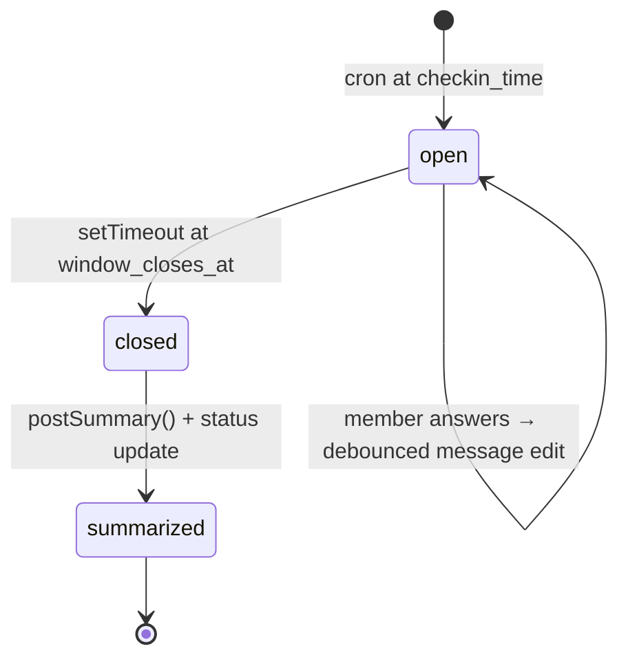
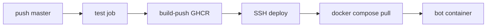

# Sushkobot — Product & Technical Specification

**Version:** 0.3.0  
**Status:** Living document — reflects implemented behavior in `src/` as of June 2026  
**Audience:** Developers, operators, and future contributors

### Revision history

| Version | Changes |
|---------|---------|
| 0.1.0 | MVP: cron windows, check-ins, summaries, conversation-based `/setup` |
| 0.2.0 | Inline-button settings wizard; region→city timezone picker; `setMyCommands` on boot; removed `@grammyjs/conversations` from bot wiring |
| 0.3.0 | GHCR deploy pipeline; production Compose pull-only; VPS bootstrap script; `.dockerignore` |

---

## 1. Purpose

Sushkobot is a **Telegram group bot** for **evening sobriety check-ins**. It:

1. Posts a **daily reminder** in the group with **inline buttons**
2. Accepts answers during a **configurable time window**
3. **Edits the reminder in place** to show live progress (N/M joined members answered)
4. Posts a **daily summary** at window close with per-member streaks

The bot is **stateless at runtime** — all durable state lives in SQLite. A single long-polling process handles Telegram updates and schedules per-chat jobs.

---

## 2. Users & Roles

| Role | Definition | Capabilities |
|------|------------|--------------|
| **Group admin** | Telegram group creator or administrator | `/setup`, `/config` |
| **Env admin** | User ID in `ADMIN_USER_IDS` | Same as group admin; required for first-time setup; dev commands in development |
| **Joined member** | User in `chat_members` with `active = true` | Counted in progress denominator and summary roster |
| **Any group member** | Anyone in the Telegram group | Can tap check-in buttons (first tap auto-joins) |

**Admin check:** `isAdmin(userId)` OR `requireGroupAdmin(ctx)` (creator/administrator in that group).

---

## 3. Scope

### 3.1 In scope (implemented)

- Per-chat **inline-button settings wizard** (`/setup`, `/config`): single message edited in place — no chat Q&A
- Settings fields: time (hour/minute buttons), timezone (region → city), window duration, question presets, response preset, label reset
- Daily open/close window with cron + one-shot close timer
- Inline button check-ins with join-on-first-answer
- `/join`, `/leave`, `/status`, `/help`
- DM `/settings` — two-level timezone picker; `/settimezone` redirects to `/settings`
- **Telegram command menu** registered via `setMyCommands` on boot (scoped: group members, group admins, private chat)
- Daily summary with streaks at window close
- Restart-safe window recovery (stale open windows closed; close timers re-scheduled)
- Bot removed from group → chat disabled, scheduler jobs unregistered
- Development mode: `/force_open`, `/force_close`
- Docker + GHCR + VPS deploy via GitHub Actions (build in CI, pull on server)

### 3.2 Out of scope / not yet implemented

| Feature | Notes |
|---------|-------|
| **`yes_no_note` DM follow-up** | Preset exists; behaves like `yes_no`. `checkins.note` column unused. |
| **Mid-window nudge** | `chats.nudge_enabled` column exists; no logic wired. |
| **Periodic countdown refresh** | Countdown updates only when someone answers (debounced edit). |
| **Personal timezone in scheduling** | `members.timezone_override` stored via DM `/settings`; not used for window date, cron, or streaks. |
| **Custom question text** | Wizard offers preset questions only; free-text question not in button UI. |
| **Custom label JSON** | Wizard can reset to defaults; JSON entry not in button UI. |
| **`/stats`** | Weekly/monthly aggregates — planned Phase 3. |
| **Streak milestones** | 7/30/90-day celebrations — planned Phase 3. |
| **i18n** | Bot chrome is English; question/labels customizable per chat. |
| **Per-person window times** | v2 — separate DM reminders at different hours. |
| **Webhook mode** | Long polling only. |

---

## 4. Core User Flows

### 4.1 Chat onboarding (`/setup` / `/config`)



**UX principles:**

- **No conversational Q&A** — all choices via inline keyboards on one message
- **In-memory wizard session** keyed by `telegramChatId:userId` until save/cancel/expiry
- Only the admin who started the wizard can use its buttons

**Setup draft defaults** (before Save):

| Field | Default |
|-------|---------|
| Time | 21:00 |
| Timezone | Europe/Moscow |
| Window | 120 min |
| Question | `"Was you sober today?"` |
| Preset | `yes_no` |
| Labels | defaults (null in DB) |

**Config mode:** loads current `chats` row; each field change persists immediately.

See **§4.4 Settings wizard** for field pickers and callback protocol.

### 4.2 Daily check-in window



**Window open (cron):**

1. Compute `checkin_date` = calendar date in chat timezone at open time
2. If row exists for chat+date and already summarized → skip (unless `force`)
3. If row exists with `message_id` and status `open` → reuse (no duplicate post)
4. Else insert/update `daily_windows`, post reminder + buttons, store `message_id`
5. Schedule one-shot close timer

**Member answers (callback):**

1. Validate: group chat, chat configured, window `open`, now < `window_closes_at`
2. `ensureMember` + `joinChatMember` (auto-join)
3. Upsert `checkins` (one per member per window; re-tap updates status)
4. Debounced `editMessageText` on reminder
5. Ephemeral toast: `"Recorded ✅"`

**Window close (timer or `/force_close`):**

1. Edit reminder: remove buttons, append `"Check-in closed."`
2. Set status `closed`
3. Post summary message
4. Set status `summarized`

### 4.3 Member roster

| Action | Behavior |
|--------|----------|
| First button tap | Auto-join (`chat_members.active = true`) |
| `/join` | Explicit opt-in |
| `/leave` | `active = false`; past check-ins retained; excluded from denominator and summary |
| Re-join after leave | New `joined_at`; streak history preserved |

**Progress rule:** `answeredCount` / `joinedCount` — only **active** `chat_members` count.

### 4.4 Settings wizard

**Entry:** `/setup` (new chat) or `/config` (existing chat). Admin-only.

**Main menu** shows current values + buttons: Time, Timezone, Window, Question, Buttons, Labels. Setup adds **Save & enable** and **Cancel**; config adds **Close**.

| Sub-screen | Picker options |
|------------|----------------|
| Time | Hours 19–23; minutes :00/:15/:30/:45 |
| Timezone | **Step 1:** region — Europe, Americas, Asia, Pacific & UTC. **Step 2:** cities in region (see table below) |
| Window | 60, 90, 120, 180, 240 minutes |
| Question | 3 presets (EN default, EN formal, RU) |
| Buttons | `yes_no`, `yes_no_note`, `sober_slip_skip` |
| Labels | Reset to defaults |

**Timezone regions and cities:**

| Region | Cities (IANA) |
|--------|----------------|
| Europe | Moscow, Kyiv, London, Berlin, Paris, Istanbul |
| Americas | New York, Chicago, Los Angeles, Toronto, São Paulo |
| Asia | Dubai, Tashkent, Almaty, Tokyo, Singapore |
| Pacific & UTC | UTC, Sydney, Auckland |

Current selection marked with `•` on matching region/city. Navigation: **← Regions** (city → region), **← Back** (region → main menu).

**Callback prefix:** `set:` (separate from `checkin:`). Examples: `set:screen:time`, `set:tzr:europe`, `set:tzc:moscow`, `set:save`, `set:back`, `set:tz_back`.

**DM timezone** (`/settings`): same region→city flow with prefix `set:dm:`; **Clear override** on region screen.

---

## 5. Commands

| Command | Where | Who | Behavior |
|---------|-------|-----|----------|
| `/setup` | Group | Admin | Inline-button settings wizard; draft until **Save & enable** |
| `/config` | Group | Admin | Same wizard UI; loads DB; saves per field |
| `/join` | Group | Anyone | Opt in to tracking |
| `/leave` | Group | Anyone | Opt out |
| `/status` | Group | Anyone | Window state, today's progress, caller's streak |
| `/help` | Anywhere | Anyone | Command list |
| `/settings` | DM | Anyone | Personal timezone — region→city button picker |
| `/settimezone` | DM | Anyone | Redirects to `/settings` |
| `/force_open` | Group | Env admin | `BOT_ENV=development` only — opens window now |
| `/force_close` | Group | Env admin | Dev only — closes window + summary |

### 5.1 Telegram command menu (`setMyCommands`)

Registered on boot in `registerBotCommands()` (`src/bot/commands.ts`) — replaces manual BotFather `/setcommands`.

| Scope | Commands |
|-------|----------|
| `all_group_chats` | join, leave, status, help |
| `all_chat_administrators` | setup, config, (+ force_open, force_close in dev), join, leave, status, help |
| `all_private_chats` | settings, help |

API constraint: command names are `a-z`, `0-9`, `_` only.

---

## 6. Response Presets & Streak Logic

Presets define **button keys** (internal) and **check-in status** (stored). Custom **labels** are display-only.

| Preset | Buttons (keys) | Default labels | Status mapping |
|--------|----------------|----------------|----------------|
| `yes_no` | yes, no | ✅ Yes / ❌ No | yes → sober, no → slip |
| `yes_no_note` | yes, no | ✅ Yes / ❌ No | same as `yes_no` (note flow not built) |
| `sober_slip_skip` | sober, slip, skip | ✅ Sober / ❌ Slip / ⏭ Skip | sober → sober, slip → slip, skip → skipped |

**Callback data format:** `checkin:<presetKey>` (must stay under Telegram's 64-byte limit).

**Streak calculation** (`calculateStreak`, computed at summary time):

- Walk backward from day before `checkin_date`
- `sober` → increment streak, continue
- `skipped` → neutral (skip day, continue walking)
- `slip` or missing day → stop (streak = 0 if today is slip)
- Not stored in DB; derived from `checkins` history (up to 365 days)

**Slip/no behavior:** Silent — toast only. No DM or group support message.

---

## 7. Message Formats

### 7.1 Open window reminder

```
🌙 Evening check-in — May 26

Was you sober today?
Answer before 01:00 (2h 15m left)

3 of 7 joined members answered

[ inline buttons per preset ]
```

- Date label: `MMM d` from `checkin_date`
- Close time: `HH:mm` in **chat timezone**
- Countdown: `Xh Ym left` or `Ym left`

### 7.2 Closed reminder (edited in place)

Same header and question; footer:

```
Check-in closed.
```

Buttons removed.

### 7.3 Daily summary (new message)

```
📊 May 26 summary

Answered: 5/7 joined
✅ @alice — 12 day streak
✅ @bob — 3 day streak
❌ @carol — streak reset
⏳ @dave — no answer
```

- Only **joined** members listed
- Mention: `@username` if set, else display name
- No answer → `⏳ … — no answer`

---

## 8. Scheduling Model

| Level | Controls |
|-------|----------|
| **Chat** | `checkin_hour`, `checkin_minute`, `window_duration_minutes`, `timezone`, question, preset, labels, `enabled` |
| **Person** | `timezone_override` (stored only — not applied to scheduling in v0.1) |

**Cron pattern:** `{minute} {hour} * * *` in chat timezone (croner).

**Window close:** `window_opens_at + window_duration_minutes` (UTC ISO stored). May cross midnight.

**Check-in date invariant:** Calendar day when window **opened** in chat TZ — not the close day.

Example: open May 26 23:00, close May 27 01:00 → `checkin_date = 2026-05-26`.

**One window per chat per calendar day.** Second cron fire same day: no-op if already summarized; reuses open window if still open.

---

## 9. Data Model

SQLite via Drizzle. Telegram IDs stored as `text`.

### 9.1 Tables

```
chats
  id, telegram_chat_id (unique), title, timezone
  checkin_hour (default 21), checkin_minute (default 0)
  window_duration_minutes (default 120)
  question_text, response_mode, button_labels (JSON text, nullable)
  nudge_enabled (default false), enabled (default true), created_at

members
  id, telegram_user_id (unique), username, display_name
  timezone_override (nullable), created_at

chat_members
  id, chat_id → chats, member_id → members
  joined_at, left_at (nullable), active (default true)
  unique (chat_id, member_id)

daily_windows
  id, chat_id → chats, checkin_date
  message_id (nullable), window_opens_at, window_closes_at
  status: open | closed | summarized
  unique (chat_id, checkin_date)

checkins
  id, daily_window_id, chat_id, member_id
  checkin_date, status: sober | slip | skipped
  note (nullable, unused), answered_at
  unique (daily_window_id, member_id)
```

### 9.2 Status lifecycles

**`daily_windows.status`:** `open` → `closed` → `summarized` (terminal)

**`chat_members.active`:** `true` while opted in; `false` after `/leave`

---

## 10. Architecture

```
src/index.ts                    Boot: migrate → createBot → scheduler.start() → setMyCommands → poll
src/env.ts                      Zod-validated env
src/bot/commands.ts             Telegram command menu (setMyCommands)
src/bot/handlers/setup-wizard.ts  /setup, /config + set: callbacks
src/bot/keyboards/settings-wizard.ts  Wizard keyboards, TZ regions, callback parse
src/bot/                        grammY wiring, handlers, keyboards
src/services/                   Business logic (window, scheduler, members, streak, summary)
src/db/                         Drizzle schema, client, migrations
drizzle/                        SQL migrations
tests/                          unit, integration, handler fixtures
```

### 10.1 Key design decisions

- **Stateless bot:** Durable state in DB; in-memory: scheduler jobs, message debouncer, **wizard sessions** (`chatId:userId`), **DM timezone sessions** (`userId`)
- **`BotContext`:** plain `Context` + `db` + `scheduler` via middleware (no conversations plugin)
- **Settings UX:** single `editMessageText` message; inline `set:*` callbacks (group) and `set:dm:*` (private)
- **Check-in UX:** inline `checkin:*` callbacks on window reminder message
- **Thin handlers:** Parse Telegram ctx → call service
- **Shared paths:** Cron and dev commands both call `openWindow()` / `closeWindow()`
- **Edit debouncing:** `DEBOUNCE_MS` (default 2000; 0 in tests) per `chat_id:message_id`
- **Restart recovery:** `recoverStaleWindows()` on `scheduler.start()` — overdue open windows closed immediately; others get close timer
- **Command discovery:** `setMyCommands` on `onStart` — no BotFather maintenance for command list

### 10.2 Stack

| Layer | Technology |
|-------|------------|
| Runtime | Bun 1.x |
| Package manager | pnpm 11.2.1 |
| Language | TypeScript 7 (`tsgo`) |
| Bot | grammY (inline keyboards; `@grammyjs/conversations` in deps but unused) |
| DB | Drizzle ORM + `bun:sqlite` |
| Scheduler | croner + `setTimeout` |
| Dates | Luxon (IANA TZ) |
| Env | Zod + `@t3-oss/env-core` |
| Lint/format | Biome |
| Tests | `bun:test` |

---

## 11. Environment

| Variable | Required | Default | Description |
|----------|----------|---------|-------------|
| `BOT_TOKEN` | yes | — | Telegram bot token |
| `ADMIN_USER_IDS` | yes | — | Comma-separated Telegram user IDs |
| `BOT_ENV` | no | `production` | `development` enables force commands |
| `DATABASE_PATH` | no | `./data/sushkobot.db` | SQLite file path |
| `LOG_LEVEL` | no | `info` | `debug`, `info`, `warn`, `error` |
| `DEBOUNCE_MS` | no | `2000` | Message edit debounce interval |

**Development:** `.env.development` + test bot + private test group.  
**Production:** VPS `/opt/sushkobot/.env`, Docker Compose, DB volume at `./data`.

---

## 12. Edge Cases

| Case | Expected behavior |
|------|-------------------|
| Re-tap while window open | Update same check-in; counter unchanged if same member |
| Tap after deadline | Toast `"Check-in closed"`; no DB write |
| Bot restart mid-window | Resume: re-schedule close; no repost if `message_id` exists |
| Bot removed from group | `chats.enabled = false`; unregister scheduler |
| `/leave` mid-window | Removed from denominator; today's answer kept if already submitted |
| Window crosses midnight | `checkin_date` = open day |
| Many simultaneous answers | Debounced edits (max ~1 per 2s per message) |
| `/force_open` after summarized day | Reopens window (`force: true`), clears `message_id`, new post |
| Edit message fails | Swallowed (unchanged/deleted message) |

---

## 13. Testing & Quality

### 13.1 Automated (CI)

```bash
pnpm typecheck   # tsgo --noEmit
pnpm lint        # biome check .
bun test         # unit + integration + handlers (mocked Telegram API)
```

**Layers:**

1. **Unit** — streak math, window message format, env validation
2. **Integration** — real `:memory:` SQLite, check-in upsert, join/leave
3. **Handlers** — `bot.handleUpdate(fixture)` with API transformer mock

No real Telegram in CI.

### 13.2 Manual smoke (dev)

1. `/setup` in test group
2. `/force_open` → buttons appear
3. Tap → toast + `1/N answered`
4. Re-tap → answer updates, count same
5. `/force_close` → summary with streaks
6. Tap after close → `"Check-in closed"`
7. Restart bot mid-window → no duplicate post

---

## 14. Deployment



### 14.1 Workflows

| Workflow | Trigger | Jobs |
|----------|---------|------|
| [`ci.yml`](../.github/workflows/ci.yml) | PR | lint, typecheck, test |
| [`deploy.yml`](../.github/workflows/deploy.yml) | push `master` | test → build-push → deploy |

**GHCR tags:** `ghcr.io/<owner>/sushkobot:latest` and `:sha-<7-char-commit>`

### 14.2 VPS layout

```
/opt/sushkobot/
├── .env                 # BOT_TOKEN, ADMIN_USER_IDS, GHCR_IMAGE, IMAGE_TAG, DATABASE_PATH
├── data/                # SQLite volume mount → /app/data in container
├── backups/
└── app/                 # git clone; docker-compose.yml lives here
```

Compose ([`docker-compose.yml`](../docker-compose.yml)):

- `image: ${GHCR_IMAGE}:${IMAGE_TAG}` — no `build:` on server
- `env_file: ../.env`
- `volumes: ../data:/app/data`
- Run with: `docker compose --env-file /opt/sushkobot/.env ...`

One-time bootstrap: [`deploy/bootstrap-vps.sh`](../deploy/bootstrap-vps.sh)

### 14.3 GitHub secrets

| Secret | Purpose |
|--------|---------|
| `VPS_HOST` | Server address |
| `VPS_USER` | SSH user |
| `VPS_SSH_KEY` | Private key |
| `GHCR_READ_TOKEN` | Optional — PAT with `read:packages` if GHCR package is private |

`GITHUB_TOKEN` pushes images during `build-push` (no extra secret for push).

### 14.4 Rollback and backups

**Rollback:** set `IMAGE_TAG=sha-<older>` in `/opt/sushkobot/.env`, then `docker compose --env-file ... pull && up -d`.

**Backup:** copy `/opt/sushkobot/data/sushkobot.db` to `backups/` (daily cron recommended).

**Restore:** stop container, replace DB file, start container. Scheduler rehydrates from `daily_windows`.

### 14.5 Container build

- [`Dockerfile`](../Dockerfile) — `oven/bun:1.2`, `pnpm typecheck` at build
- [`.dockerignore`](../.dockerignore) — excludes `node_modules`, `.env*`, `data/`, tests

---

## 15. Future Work (prioritized)

### Phase 2 — Configurability polish

- [x] Inline-button settings wizard (replaced conversation `/setup` `/config`)
- [x] Region→city timezone picker (group + DM)
- [x] `setMyCommands` command menu on boot
- [ ] Custom question text in wizard (beyond presets)
- [ ] Custom label JSON in wizard
- [ ] `yes_no_note`: DM note capture after answer; persist `checkins.note`
- [ ] Mid-window nudge for unanswered joined members (`nudge_enabled`)
- [ ] Periodic countdown refresh while window open (~every 15 min)

### Phase 3 — Analytics & polish

- [ ] `/stats` — weekly/monthly aggregates
- [ ] Streak milestones (7, 30, 90 days)
- [ ] Apply `timezone_override` to personal "today" boundary / display
- [ ] Bot UI i18n (RU/EN)

### Phase 4 — Scale (if needed)

- [ ] Postgres via Drizzle dialect swap
- [ ] Per-person reminder times (DM at member-local hour)
- [ ] Webhook mode + reverse proxy

---

## 16. Open Questions

Decisions not yet locked in product behavior:

1. **Default check-in time** — schema default 21:00; confirm for production group
2. **Mid-window nudge timing** — e.g. at 50% elapsed vs fixed offset before close
3. **`yes_no_note` UX** — immediate DM vs optional "add note" button
4. **Personal timezone semantics** — affect streak "today" only, or future per-person windows?
5. **Language** — English chrome + localized question/labels, or full RU UI?

---

## Appendix A — File Map

| Path | Responsibility |
|------|----------------|
| `src/index.ts` | Entry, migrations, scheduler start, `setMyCommands`, polling |
| `deploy/bootstrap-vps.sh` | One-time VPS setup |
| `.dockerignore` | Docker build context exclusions |
| `docker-compose.yml` | Production Compose (GHCR pull, parent `.env` + `data/`) |
| `src/bot/bot.ts` | Bot factory, middleware, handler registration |
| `src/bot/commands.ts` | `registerBotCommands()` — scoped `setMyCommands` |
| `src/bot/handlers/setup-wizard.ts` | `/setup`, `/config`, `set:*` callback handler |
| `src/bot/handlers/checkin.ts` | `checkin:*` callback handler |
| `src/bot/handlers/common.ts` | `/help`, `/join`, `/leave`, `/status` |
| `src/bot/handlers/dev.ts` | `/force_open`, `/force_close` |
| `src/bot/handlers/settings.ts` | DM `/settings`, `set:dm:*` callbacks |
| `src/bot/keyboards/settings-wizard.ts` | Settings keyboards, TZ regions/cities, callback parse |
| `src/bot/keyboards/checkin.ts` | Check-in inline keyboard + callback parse |
| `src/services/window.ts` | `openWindow`, `closeWindow`, `recoverStaleWindows` |
| `src/services/scheduler.ts` | Cron open + close timers |
| `src/services/members.ts` | Roster, `recordCheckin`, progress refresh |
| `src/services/summary.ts` | `postSummary` |
| `src/services/streak.ts` | Streak calculation |
| `src/services/window-message.ts` | Message text builders |
| `src/services/message-debounce.ts` | Telegram edit rate limiting |
| `src/types.ts` | Presets, status enums, button label helpers |
| `src/texts.ts` | User-facing strings |
| `src/db/schema.ts` | Drizzle tables |

---

## Appendix B — Related Documents

- [`README.md`](../README.md) — quick start, deploy, env reference
- [`.cursor/plans/sobriety_telegram_bot_1f01d187.plan.md`](../.cursor/plans/sobriety_telegram_bot_1f01d187.plan.md) — original design plan (some items ahead of implementation)
- Serena memories: `mem:core`, `mem:conventions`, `mem:bot/core`, `mem:services/core`
