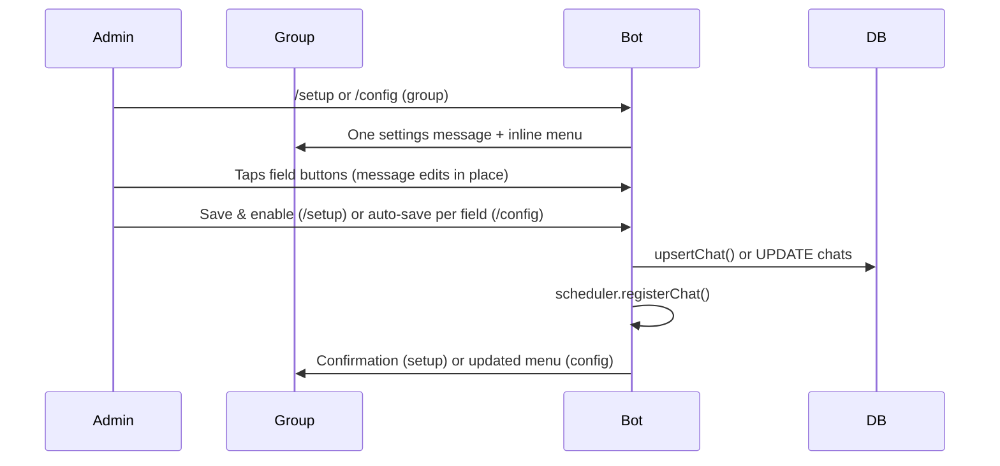
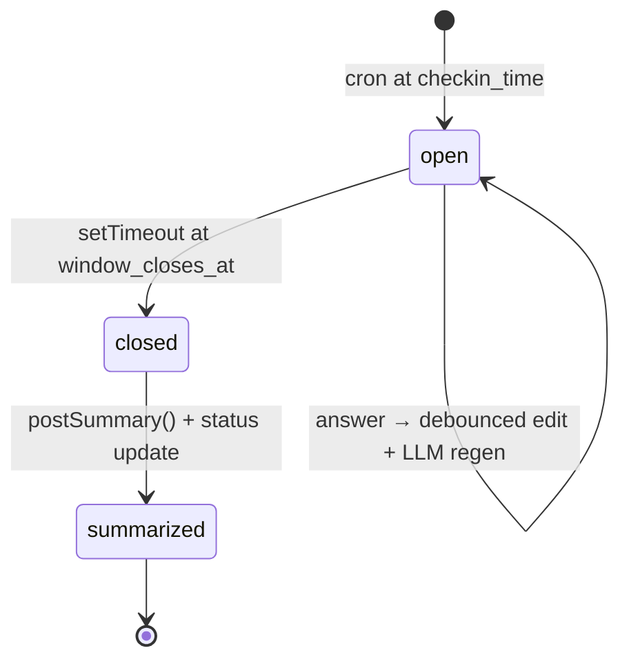
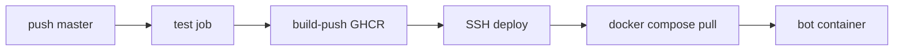

# Sushkabot — Product & Technical Spec

**Version:** 0.5.0 | **Status:** living doc, matches `src/` June 2026 | **Audience:** devs, ops, contributors

### Revision history

| Version | Changes |
|---------|---------|
| 0.1.0 | MVP: cron windows, check-ins, summaries, conversation-based `/setup` |
| 0.2.0 | Inline-button settings wizard; region→city timezone picker; `setMyCommands` on boot; removed `@grammyjs/conversations` from bot wiring |
| 0.3.0 | GHCR deploy pipeline; production Compose pull-only; VPS bootstrap script; `.dockerignore` |
| 0.4.0 | Fixed Sushka buttons; dual sober/intox streaks; LLM window/summary/stats; live window regen; chat cleanup (`bot_posts`); `/stats` ephemeral |
| 0.5.0 | Shared LLM context (chat + roster) on all generations; lively/sarcastic tone; summary = LLM body only; delete silent window invites on close; reaction tracking; DeepSeek thinking disabled; debug LLM logs |

---

## 1. Purpose

Telegram group bot for **evening sobriety check-ins**:

1. Daily reminder + inline buttons
2. Answers during configurable window
3. In-place edit: LLM body regen after each answer — highlights (who pressed what) woven into invitation text
4. Window close → **LLM-only summary** (no roster lines in message)

Stateless runtime; SQLite durable state. One long-polling process + per-chat schedulers.

---

## 2. Users & Roles

| Role | Definition | Capabilities |
|------|------------|--------------|
| **Group admin** | Telegram group creator or administrator | `/setup`, `/config` |
| **Env admin** | User ID in `ADMIN_USER_IDS` | Same as group admin; required for first-time setup; dev commands in development |
| **Joined member** | User in `chat_members` with `active = true` | Counted in progress denominator and summary roster |
| **Any group member** | Anyone in the Telegram group | Can tap check-in buttons (first tap auto-joins) |

**Admin check:** `isAdmin(userId)` OR `requireGroupAdmin(ctx)` (creator/administrator in that group).

---

## 3. Scope

### 3.1 In scope (implemented)

- Per-chat **inline-button settings wizard** (`/setup`, `/config`): single message edited in place — no chat Q&A
- Settings fields: time, timezone, window duration (question/buttons fixed)
- Daily open/close window with cron + one-shot close timer
- Inline check-in buttons: Красавчик / Оступился / Пидорнулся
- `/stats`, `/help` in group; `/status` redirects to `/stats`
- LLM copy (optional): window open, live updates, evening summary, personal stats — all fed **chat snippets + participant roster + style examples**
- Chat hygiene: delete stale bot posts on new window open; delete window invitation on close if no reply/reaction; `/stats` TTL
- Reaction tracking on bot posts (`message_reaction`, `message_reaction_count`)
- Dual streaks: grace `minor_slip`; two consecutive slips break sober streak (stats + LLM context, not summary roster lines)
- DM `/settings` — timezone picker
- **Telegram command menu** registered via `setMyCommands` on boot (scoped: group members, group admins, private chat)
- Daily summary — LLM body only at window close
- Restart-safe window recovery (stale open windows closed; close timers re-scheduled)
- Bot removed from group → chat disabled, scheduler jobs unregistered
- Development mode: `/force_open`, `/force_close`
- Docker + GHCR + VPS deploy via GitHub Actions (build in CI, pull on server)

### 3.2 Out of scope / not yet implemented

| Feature | Notes |
|---------|-------|
| **Mid-window nudge** | `chats.nudge_enabled` column exists; no logic wired. |
| **Periodic countdown refresh** | Footer countdown updates only when someone answers (debounced edit). |
| **Personal timezone in scheduling** | `members.timezone_override` stored via DM `/settings`; not used for window date, cron, or streaks. |
| **Configurable question/buttons** | Fixed for all chats: «Оступился? Пидорнулся?» + three buttons. Legacy `question_text` / `response_mode` columns kept for compat. |
| **`checkins.note`** | Column unused; no DM follow-up after answer. |
| **Group weekly `/stats` rollups** | Personal `/stats` in group implemented; aggregate analytics Phase 3. |
| **Streak milestone messages** | Milestones feed LLM highlights only; no separate celebration posts. |
| **Per-person window times** | v2 — separate DM reminders at different hours. |
| **Bot reply to group messages** | Future phase — contextual LLM replies with rate-limit. |
| **Webhook mode** | Long polling only. |

---

## 4. Core User Flows

### 4.1 Chat onboarding (`/setup` / `/config`)



**UX:** no chat Q&A — inline keyboards on one message. Wizard session in-memory (`telegramChatId:userId`). Only starter admin uses wizard buttons.

**Setup draft defaults** (before Save):

| Field | Default |
|-------|---------|
| Time | 21:00 |
| Timezone | Europe/Moscow |
| Window | 120 min |

Question and buttons are **not configurable** in the wizard. On save, DB gets `question_text = "Оступился? Пидорнулся?"` and `response_mode = "sushka"`.

**Config mode:** loads current `chats` row; each field change persists immediately.

See **§4.4 Settings wizard** for field pickers and callback protocol.

### 4.2 Daily check-in window



**Window open (cron):**

1. `cleanupStaleBotPosts()` — delete prior bot messages without replies (summary, stats, old windows)
2. Compute `checkin_date` = calendar date in chat timezone at open time
3. If row exists for chat+date and already summarized → skip (unless `force`)
4. If row exists with `message_id` and status `open` → reuse (no duplicate post), unless `force` → regen body + edit in place
5. Else insert/update `daily_windows`; LLM generates `generated_body` with shared context (or fallback question)
6. Post reminder + fixed inline buttons; `trackBotPost(kind: window)`
7. Schedule one-shot close timer

**Member answers (callback `checkin:krasavchik|ostupilsya|pidornulsya`):**

1. Validate: group chat, chat configured, window `open`, now < `window_closes_at`
2. `ensureMember` + `joinChatMember` (auto-join)
3. Resolve status via **§6** (`resolveCheckinStatus` — escalation on repeat «Оступился»)
4. Upsert `checkins` (one per member per window; re-tap updates status)
5. Immediate debounced `editMessageText` (footer counter + current body)
6. Debounced LLM regen (`LLM_DEBOUNCE_MS`) → update `live_body` → edit again
7. Toast by result: «Красавчик 💪» / «Записано» / «Принято»

**Window close (timer or `/force_close`):**

1. `recordAbsentAsMinorSlip()` — joined members with no answer get `minor_slip`
2. If window post has **no Telegram reply and no reaction** → **delete** invitation message (button taps do **not** count)
3. Else edit reminder: remove buttons, footer «Окно закрыто.»
4. Set status `closed`
5. Post summary message (LLM body only); `trackBotPost(kind: summary)`
6. Set status `summarized`

### 4.3 Member roster

| Action | Behavior |
|--------|----------|
| First button tap | Auto-join (`chat_members.active = true`) |
| Silent at window close | Auto `minor_slip` check-in recorded |

**Progress rule:** `answeredCount` / `joinedCount` — only **active** `chat_members` count.

There is no `/join` or `/leave` command in v0.4; roster is driven by check-in taps.

### 4.4 Settings wizard

**Entry:** `/setup` (new chat) or `/config` (existing chat). Admin-only.

**Main menu** shows: Time, Timezone, Window, plus note that question/buttons are fixed. Setup adds **Save & enable** and **Cancel**; config adds **Close**.

| Sub-screen | Picker options |
|------------|----------------|
| Time | Hours 19–23; minutes :00/:15/:30/:45 |
| Timezone | **Step 1:** region — Europe, Americas, Asia, Pacific & UTC. **Step 2:** cities in region (see table below) |
| Window | 60, 90, 120, 180, 240 minutes |

**Timezone regions and cities:**

| Region | Cities (IANA) |
|--------|----------------|
| Europe | Moscow, Kyiv, London, Berlin, Paris, Istanbul |
| Americas | New York, Chicago, Los Angeles, Toronto, São Paulo |
| Asia | Dubai, Tashkent, Almaty, Tokyo, Singapore |
| Pacific & UTC | UTC, Sydney, Auckland |

Current selection marked with `•` on matching region/city. Navigation: **← Regions** (city → region), **← Back** (region → main menu).

**Callback prefix:** `set:` (separate from `checkin:`). Examples: `set:screen:time`, `set:tzr:europe`, `set:tzc:moscow`, `set:save`, `set:back`, `set:tz_back`.

**DM timezone** (`/settings`): same region→city flow with prefix `set:dm:`; **Clear override** on region screen.

---

## 5. Commands

| Command | Where | Who | Behavior |
|---------|-------|-----|----------|
| `/setup` | Group | Admin | Inline settings wizard; draft until **Save & enable** |
| `/config` | Group | Admin | Same wizard UI; loads DB; saves per field |
| `/stats` | Group | Anyone | Personal stats (LLM or fallback); ephemeral — see **§7.4** |
| `/status` | Group | Anyone | Redirects to use `/stats` |
| `/help` | Anywhere | Anyone | Command list (Russian) |
| `/settings` | DM | Anyone | Personal timezone — region→city button picker |
| `/settimezone` | DM | Anyone | Redirects to `/settings` |
| `/force_open` | Group | Env admin | `BOT_ENV=development` only — opens window now |
| `/force_close` | Group | Env admin | Dev only — closes window + summary |

### 5.1 Telegram command menu (`setMyCommands`)

Registered on boot in `registerBotCommands()` (`src/bot/commands.ts`).

| Scope | Commands |
|-------|----------|
| `all_group_chats` | stats, help |
| `all_chat_administrators` | setup, config, (+ force_open, force_close in dev), stats, help |
| `all_private_chats` | settings, help |

### 5.2 Telegram bot requirements

| Requirement | Why |
|-------------|-----|
| **Supergroup admin** with delete messages | Cleanup of old bot posts (>48h needs admin) |
| **Privacy Mode off** (`/setprivacy` → Disable) | Bot reads group text for `chat_snippets` LLM context |
| **Can post + edit messages** | Window reminder edits in place |

---

## 6. Check-in Buttons, Status & Streak Logic

### 6.1 Fixed button set

All chats use the same buttons. Not configurable in wizard.

| Button (label) | Callback key | Base status | Meaning |
|----------------|--------------|-------------|---------|
| 💪 Красавчик | `krasavchik` | `sober` | Nothing consumed |
| 🍺 Оступился | `ostupilsya` | `minor_slip` | Minor slip (small amount) |
| 💥 Пидорнулся | `pidornulsya` | `major_slip` | Major relapse |

**Callback format:** `checkin:<key>` where `<key>` is one of `krasavchik`, `ostupilsya`, `pidornulsya`.

**Fallback question** (no LLM): `Оступился? Пидорнулся?` (`DEFAULT_QUESTION` in `src/types.ts`).

### 6.2 Status resolution rules

Applied in `resolveCheckinStatus()` when a button is tapped:

| Rule | Behavior |
|------|----------|
| **Красавчик** | Always `sober` |
| **Пидорнулся** | Always `major_slip` |
| **Оступился** after yesterday was `sober` or no record | `minor_slip` |
| **Оступился** after yesterday was `minor_slip` or `major_slip` | Escalates to `major_slip` |
| **No answer by window close** | Auto `minor_slip` for all joined members (`recordAbsentAsMinorSlip`) |

Legacy DB values: `slip` → `major_slip`, `skipped` → `minor_slip` (via `normalizeCheckinStatus`).

### 6.3 Dual streak model

Two independent streaks, computed from `checkins` history (up to 365 days). Not stored in DB.

**Sober streak** (`calculateSoberStreak`) — walk backward from `asOfDate` inclusive:

| Day status | Effect on sober streak |
|------------|------------------------|
| `sober` | +1, continue |
| `minor_slip` (single*) | Day not counted; streak unchanged; continue walking back |
| `minor_slip` after previous day was slip | **Break** (two consecutive slip days) |
| `major_slip` | **Break** |
| Missing day (no row) | **Stop** walking |

\*Single = previous calendar day was not a slip status.

**Intox streak** (`calculateIntoxStreak`) — consecutive slip days (`minor_slip` or `major_slip`) ending at `asOfDate`.

**Stats snapshot** (`buildMemberStats`): `soberCurrent`, `soberMax`, `intoxCurrent`, `intoxMax`, `totalSoberDays`, `totalSlipDays`. Fed to LLM via `buildParticipantRosterStats` — not rendered as summary lines.

### 6.4 Highlight events (for live LLM)

`detectTodayEvent()` classifies today's answer for LLM context:

| Event | When |
|-------|------|
| `extended_sober` | Sober day extends streak |
| `grace_minor` | Minor slip but sober streak preserved |
| `broke_sober` | Sober streak broken |
| `started_intox` | First day of intox streak |
| `extended_intox` | Another consecutive slip day |
| `milestone_7/30/90` | Sober streak hits milestone |
| `routine` | Nothing notable |

When `answeredCount > HIGHLIGHT_FULL_LIST_MAX` (default 5), only non-`routine` events are sent to LLM (`highlights_only` mode).

**Slip behavior:** No DM or group support message — toast only.

---

## 7. Message Formats & LLM Generation

Messages split into **template parts** (code) and **LLM body** (optional). LLM disabled when `OPENAI_API_KEY` unset — static fallbacks apply.

**Tone (all LLM):** lively, sarcastic, emotional — «свой в чате». Not dry support copy.

### 7.0 Shared LLM context (`src/services/llm-context.ts`)

Every LLM call (`open`, `live`, `summary`, `stats`) receives the same base context via `buildLlmBaseContext()`:

| Block | Source | Limit |
|-------|--------|-------|
| Style examples | `llm_generations` | `LLM_STYLE_EXAMPLES` (default 5) |
| Recent chat | `chat_snippets` | `LLM_CHAT_CONTEXT_COUNT` (default 10) |
| Participant roster | active `chat_members` + streak stats | all joined members |

User prompts use sections: `## Примеры прошлых генераций`, `## Недавний чат`, `## Участники`, plus flow-specific data.

### 7.1 Window reminder (open)

**Structure** (assembled in `buildWindowMessage`):

```
{body}                        ← LLM or fallback (no date header)

⏱ до {HH:mm} ({Nч Mм}) · {answered}/{joined} ответили   ← footer (code)
[ inline buttons ]
```

No `🌙 Сушка · {date}` header — date lives only in footer countdown context if needed in LLM copy.

**Body priority:** `live_body` → `generated_body` → `chats.question_text` → `DEFAULT_QUESTION`.

**Open-window LLM** (`generateCheckinBody`, kind `open`):

- System: `CHECKIN_SYSTEM_PROMPT` — `src/prompts/messages.ts`
- Input: shared context + date, answered/joined counts
- Output: 2–4 lines, Russian, no markdown; question semantically «Оступился? Пидорнулся?»
- Cached in `daily_windows.generated_body`

**Live-window LLM** (`generateLiveWindowBody`, kind `live`) — on each answer after `LLM_DEBOUNCE_MS` (default 6000 ms):

- System: `LIVE_WINDOW_SYSTEM_PROMPT` — `src/prompts/live-window.ts`
- Input: shared context + today's highlights (who answered, status, streak deltas, events), mode `full|highlights_only`
- Task: **rewrite the invitation** for the group — mention new check-ins (`@user` + sober/slip), keep check-in question alive
- Output: body only — **no `🌙 Сушка` header, no footer, no markdown**
- Cached in `daily_windows.live_body`
- Skipped if highlight hash unchanged since last regen

**Edit debouncing:** `DEBOUNCE_MS` (default 2000) for Telegram `editMessageText`; separate timer for LLM.

### 7.2 Closed reminder (edited in place)

Same body as open; footer replaced:

```
Окно закрыто.
```

Buttons removed. No LLM call on close edit.

### 7.3 Daily summary (new message)

**Structure:** LLM body only — no header, no `Ответили: N/M`, no per-member lines.

```
{body}                        ← LLM or fallback «📊 Итоги · {d MMMM}»
```

**Summary LLM** (`generateSummaryIntro`, kind `summary`):

- System: `SUMMARY_SYSTEM_PROMPT`
- Input: shared context + date, counts, sober/minor/major breakdown
- Output: 2–5 lines — entire posted message; weave @mentions, streaks, chat context; no bullet list
- Cached in `daily_windows.generated_summary_intro`

### 7.4 `/stats` message (ephemeral)

**Delivery:** Reply in group (visible to all).

**Content:** LLM personal text (`generatePersonalStats`, kind `stats`) or `formatStatsFallback` with numeric streaks.

**Input:** shared context + personal payload (`@mention`, streaks, last 7 days).

**Lifecycle:** `trackBotPost(kind: stats, delete_after: now + STATS_TTL_MINUTES)`. Cron every minute runs `cleanupExpiredBotPosts`. If someone replies before TTL → `has_reply = true` → not deleted.

### 7.5 Chat hygiene

| Trigger | Action |
|---------|--------|
| `openWindow()` | `cleanupStaleBotPosts()` — delete bot posts without replies (except current window message) |
| Reply to bot message | `markBotPostReplied()` — cancels TTL delete; keeps window invite on close |
| Reaction on bot message | `markBotPostReacted()` — same; listens to `message_reaction` + `message_reaction_count` |
| Window close, no reply/reaction | Delete window invitation (`shouldDeleteWindowInvitation`) |
| Cron `* * * * *` | Delete expired `/stats` posts past `delete_after` |

Tracked in `bot_posts` table. Group messages stored in `chat_snippets` (ring buffer, `CHAT_SNIPPET_LIMIT`). Successful LLM outputs stored in `llm_generations` (`LLM_STYLE_EXAMPLES` kept per chat).

### 7.6 LLM provider

OpenAI-compatible API (`OPENAI_API_BASE`, `OPENAI_MODEL`, `OPENAI_API_KEY`). Works with DeepSeek, OpenAI, etc.

| Setting | Default |
|---------|---------|
| `temperature` | 0.9 |
| `max_tokens` | 1024 |
| Request timeout | 8 s |
| DeepSeek thinking | `thinking: { type: "disabled" }` at top level when API base contains `deepseek` |

On failure: keep previous body or static fallback; bot continues running.

**Debug (`LOG_LEVEL=debug`):** log LLM request URL, full payload, and response per kind (`open`, `live`, `summary`, `stats`). API key never logged.

---

## 8. Scheduling Model

| Level | Controls |
|-------|----------|
| **Chat** | `checkin_hour`, `checkin_minute`, `window_duration_minutes`, `timezone`, `enabled` |
| **Person** | `timezone_override` (stored only — not applied to scheduling) |

Fixed per chat (not wizard-editable): `question_text`, `response_mode = "sushka"`, button set in code.

**Cron pattern:** `{minute} {hour} * * *` in chat timezone (croner).

**Window close:** `window_opens_at + window_duration_minutes` (UTC ISO stored). May cross midnight.

**Check-in date invariant:** Calendar day when window **opened** in chat TZ — not the close day.

Example: open May 26 23:00, close May 27 01:00 → `checkin_date = 2026-05-26`.

**One window per chat per calendar day.** Second cron fire same day: no-op if already summarized; reuses open window if still open.

---

## 9. Data Model

SQLite via Drizzle. Telegram IDs stored as `text`.

### 9.1 Tables

```
chats
  id, telegram_chat_id (unique), title, timezone
  checkin_hour (default 21), checkin_minute (default 0)
  window_duration_minutes (default 120)
  question_text (default «Оступился? Пидорнулся?»)
  response_mode (default sushka), button_labels (legacy, nullable)
  nudge_enabled (default false), enabled (default true), created_at

members
  id, telegram_user_id (unique), username, display_name
  timezone_override (nullable), created_at

chat_members
  id, chat_id → chats, member_id → members
  joined_at, left_at (nullable), active (default true)
  unique (chat_id, member_id)

daily_windows
  id, chat_id → chats, checkin_date
  message_id (nullable), window_opens_at, window_closes_at
  status: open | closed | summarized
  generated_body, generated_summary_intro
  live_body, live_body_at
  unique (chat_id, checkin_date)

checkins
  id, daily_window_id, chat_id, member_id
  checkin_date, status: sober | minor_slip | major_slip
  note (nullable, unused), answered_at
  unique (daily_window_id, member_id)

bot_posts
  id, chat_id, telegram_message_id
  kind: window | summary | stats | command
  daily_window_id (nullable), posted_at
  has_reply (default false), has_reaction (default false), delete_after (nullable), deleted_at (nullable)
  unique (chat_id, telegram_message_id)

chat_snippets
  id, chat_id, telegram_message_id, author_name, text, posted_at

llm_generations
  id, chat_id, kind: open | live | summary | stats, text, created_at
```

Migrations in `drizzle/*.sql`. Applied automatically on bot start (`runMigrations` in `src/index.ts`) — including Docker container restart after deploy. No manual `pnpm db:migrate` on VPS required.

### 9.2 Status lifecycles

**`daily_windows.status`:** `open` → `closed` → `summarized` (terminal)

**`chat_members.active`:** `true` while member has joined via check-in tap

**Legacy checkin statuses** in old rows: `slip`, `skipped` — normalized at read time (see **§6.2**).

---

## 10. Architecture

```
src/index.ts                    Boot: migrate → createBot → scheduler.start() → setMyCommands → poll (reactions in allowed_updates)
src/env.ts                      Zod-validated env (incl. OPENAI_*, LLM_DEBOUNCE_MS, LLM_CHAT_CONTEXT_COUNT, STATS_TTL_*)
src/bot/commands.ts             Telegram command menu (setMyCommands)
src/bot/handlers/setup-wizard.ts  /setup, /config + set: callbacks
src/bot/handlers/reactions.ts   message_reaction → markBotPostReacted
src/bot/handlers/chat-log.ts    Group message log, reply tracking
src/bot/handlers/common.ts      /help, /stats, /status redirect
src/bot/keyboards/settings-wizard.ts  Wizard keyboards, TZ regions, callback parse
src/prompts/messages.ts         Open window + summary LLM prompts
src/prompts/live-window.ts      Live window + /stats LLM prompts
src/services/llm.ts             OpenAI-compatible chat completions + debug logging
src/services/llm-context.ts     Shared chat + roster context for all LLM calls
src/services/highlights.ts      Highlight context for live LLM
src/services/bot-posts.ts       Post tracking, cleanup, TTL delete
src/services/chat-snippets.ts   Recent group message ring buffer
src/services/llm-generations.ts Style example storage for LLM
src/services/checkin-status.ts  Previous-day status lookup
src/bot/                        grammY wiring, handlers, keyboards
src/services/                   window, scheduler, members, streak, summary
src/db/                         Drizzle schema, client, migrations
drizzle/                        SQL migrations (0000, 0001, 0002, …)
tests/                          unit, integration, handler fixtures
```

### 10.1 Design decisions

- Stateless bot; DB durable; in-memory schedulers, debouncers, wizard, highlight hash
- Migrations on start (`runMigrations` before poll)
- LLM optional — Russian fallbacks everywhere
- `bot_posts` + minute cron for ephemeral messages
- Edit debounce `DEBOUNCE_MS` 2000; LLM regen `LLM_DEBOUNCE_MS` 6000

### 10.2 Stack

| Layer | Technology |
|-------|------------|
| Runtime | Bun 1.x |
| Package manager | pnpm 11.2.1 |
| Language | TypeScript 7 (`tsgo`) |
| Bot | grammY (inline keyboards; `@grammyjs/conversations` in deps but unused) |
| DB | Drizzle ORM + `bun:sqlite` |
| Scheduler | croner + `setTimeout` |
| Dates | Luxon (IANA TZ, Russian locale for message dates) |
| LLM | OpenAI-compatible HTTP API (optional) |
| Env | Zod + `@t3-oss/env-core` |
| Lint/format | Biome |
| Tests | `bun:test` |

---

## 11. Environment

| Variable | Required | Default | Description |
|----------|----------|---------|-------------|
| `BOT_TOKEN` | yes | — | Telegram bot token |
| `ADMIN_USER_IDS` | yes | — | Comma-separated Telegram user IDs |
| `BOT_ENV` | no | `production` | `development` enables force commands |
| `DATABASE_PATH` | no | `./data/sushkabot.db` | SQLite file path |
| `LOG_LEVEL` | no | `info` | `debug`, `info`, `warn`, `error` |
| `DEBOUNCE_MS` | no | `2000` | Telegram edit debounce (ms) |
| `OPENAI_API_KEY` | no | — | Enables LLM copy; omit for fallbacks only |
| `OPENAI_API_BASE` | no | `https://api.openai.com/v1` | OpenAI-compatible API base URL |
| `OPENAI_MODEL` | no | `gpt-4o-mini` | Model id (e.g. DeepSeek model name) |
| `LLM_DEBOUNCE_MS` | no | `6000` | Delay before live window LLM regen after answers |
| `STATS_TTL_MINUTES` | no | `30` | `/stats` message lifetime without reply |
| `HIGHLIGHT_FULL_LIST_MAX` | no | `5` | Full answerer list in LLM prompt up to this count |
| `CHAT_SNIPPET_LIMIT` | no | `20` | Max stored group messages per chat (ring buffer) |
| `LLM_CHAT_CONTEXT_COUNT` | no | `10` | Recent snippets sent to LLM per generation |
| `LLM_STYLE_EXAMPLES` | no | `5` | Past LLM outputs fed as style examples |

**Development:** `.env.development` + test bot + private test group.  
**Production:** VPS `~/sushkabot/.env` (deploy user, no sudo), Docker Compose, DB volume at `./data`.

---

## 12. Edge Cases

| Case | Expected behavior |
|------|-------------------|
| Re-tap while window open | Update same check-in; LLM regen if highlights changed |
| Tap «Оступился» after yesterday slip | Stored as `major_slip` (escalation) |
| Silent at window close | Auto `minor_slip` for joined members without answer |
| Tap after deadline | Toast «Окно закрыто»; no DB write |
| Bot restart mid-window | Resume: re-schedule close; no repost if `message_id` exists |
| Bot removed from group | `chats.enabled = false`; unregister scheduler |
| Window crosses midnight | `checkin_date` = open day |
| Many simultaneous answers | Debounced edits + single LLM regen after debounce |
| `/force_open` on open window | Regenerate LLM body + edit message in place (`force: true`) |
| `/force_open` after summarized day | Reopens window (`force: true`), clears cached bodies, new post |
| Reaction on bot post | `has_reaction = true`; invitation kept on close |
| LLM timeout/error | Keep previous body or `DEFAULT_QUESTION`; bot continues |
| Reply to `/stats` before TTL | Message kept (`has_reply = true`) |
| New window opens | Old summary/stats without replies deleted |
| Edit/delete message fails | Swallowed; logged on delete failure |

---

## 13. Testing & Quality

### 13.1 Automated (CI)

```bash
pnpm typecheck   # tsgo --noEmit
pnpm lint        # biome check .
bun test         # unit + integration + handlers (mocked Telegram API)
```

**Layers:**

1. **Unit** — dual streak math, status resolution, window message format, env validation, highlights
2. **Integration** — real `:memory:` SQLite, check-in upsert, auto-join roster
3. **Handlers** — `bot.handleUpdate(fixture)` with API transformer mock

No real Telegram in CI.

### 13.2 Manual smoke (dev)

1. Bot admin in supergroup; Privacy Mode off; `OPENAI_*` in `.env.development` if testing LLM
2. `/setup` in test group
3. `/force_open` → buttons + LLM/fallback body
4. Tap answers → footer updates immediately; body updates ~6s later (LLM)
5. Re-tap → status changes; escalation test: «Оступился» two days in a row
6. `/force_close` → LLM-only summary; silent window invite deleted if no reply/reaction
7. `/stats` → reply in group; disappears after 30 min if no reply
8. `/force_open` next day → old summary/stats without replies deleted
9. Restart bot mid-window → no duplicate post

---

## 14. Deployment



### 14.1 Workflows

| Workflow | Trigger | Jobs |
|----------|---------|------|
| [`ci.yml`](../.github/workflows/ci.yml) | PR | lint, typecheck, test |
| [`deploy.yml`](../.github/workflows/deploy.yml) | push `master` | test → build-push → deploy |

**GHCR tags:** `ghcr.io/<owner>/sushkabot:latest` and `:sha-<7-char-commit>`

### 14.2 VPS layout

```
~/sushkabot/             # VPS_INSTALL_DIR — owned by deploy user
├── .env                 # BOT_TOKEN, ADMIN_USER_IDS, GHCR_IMAGE, IMAGE_TAG, DATABASE_PATH, OPENAI_* (optional)
├── data/                # SQLite volume mount → /app/data in container
├── backups/
└── app/                 # git clone; docker-compose.yml lives here
```

Compose ([`docker-compose.yml`](../docker-compose.yml)):

- `image: ${GHCR_IMAGE}:${IMAGE_TAG}` — no `build:` on server
- `env_file: ${ENV_FILE}` — set `export ENV_FILE=~/sushkabot/.env` before compose
- `volumes: ${DATA_DIR}:/app/data` — set `export DATA_DIR=~/sushkabot/data`
- Run from `~/sushkabot/app`: `docker compose --env-file "$ENV_FILE" ...`

One-time bootstrap (as deploy user, no sudo):

1. [`deploy/setup-repo-ssh.sh`](../deploy/setup-repo-ssh.sh) — RSA deploy key + `Host github-sushkabot` in `~/.ssh/config`; add public key as repo **Deploy key** (read-only).
2. [`deploy/bootstrap-vps.sh`](../deploy/bootstrap-vps.sh) — clone via `git@github-sushkabot:owner/sushkabot.git`.

Deploy user must be in `docker` group (one-time `usermod` as root). GitHub Actions uses a separate `VPS_SSH_KEY` to SSH into the VPS.

### 14.3 GitHub secrets

| Secret | Purpose |
|--------|---------|
| `VPS_HOST` | Server address |
| `VPS_PORT` | SSH port — optional, default `22` (Actions → VPS only) |
| `VPS_USER` | SSH user (non-root deploy user) |
| `VPS_SSH_KEY` | Private key |
| `VPS_INSTALL_DIR` | Optional — default `~/sushkabot` |
| `GHCR_READ_TOKEN` | Optional — classic PAT with `read:packages` if GHCR package is private |

`GITHUB_TOKEN` pushes images during `build-push` (no extra secret for push).

### 14.4 Rollback and backups

**Rollback:** set `IMAGE_TAG=sha-<older>` in `~/sushkabot/.env`, then `docker compose --env-file ... pull && up -d`.

**Backup:** copy `~/sushkabot/data/sushkabot.db` to `backups/` (daily cron recommended).

**Restore:** stop container, replace DB file, start container. Migrations re-run idempotently on start.

**Deploy note:** Migrations run inside container on `src/index.ts` boot — no separate migrate step on VPS.

### 14.5 Container build

- [`Dockerfile`](../Dockerfile) — `oven/bun:1.2`, `pnpm typecheck` at build
- [`.dockerignore`](../.dockerignore) — excludes `node_modules`, `.env*`, `data/`, tests

---

## 15. Future Work (prioritized)

### Phase 2 — done in v0.4–0.5

- [x] Fixed Sushka buttons + escalation + auto silent «Оступился»
- [x] Dual sober/intox streaks with grace day
- [x] LLM window open, live updates, summary, `/stats`
- [x] Shared LLM context (chat snippets + participant roster) on all generations
- [x] Lively/sarcastic tone; summary = LLM body only
- [x] Delete silent window invitations on close; reaction tracking
- [x] Chat hygiene (`bot_posts`, ephemeral stats)
- [x] Inline-button settings wizard (time / TZ / window only)
- [x] Region→city timezone picker (group + DM)
- [x] DeepSeek V4 thinking disabled; debug LLM logs

### Phase 3 — Analytics & polish

- [ ] Group weekly/monthly aggregate stats
- [ ] Dedicated streak milestone celebration messages
- [ ] Mid-window nudge for unanswered joined members (`nudge_enabled`)
- [ ] Periodic countdown refresh while window open
- [ ] Apply `timezone_override` to personal display boundaries
- [ ] Optional `checkins.note` / DM follow-up on slip

### Phase 4 — Scale (if needed)

- [ ] Postgres via Drizzle dialect swap
- [ ] Per-person reminder times (DM at member-local hour)
- [ ] Webhook mode + reverse proxy

---

## 16. Open Questions

1. **Default check-in time** — schema default 21:00; confirm for production group
2. **Mid-window nudge timing** — e.g. at 50% elapsed vs fixed offset before close
3. **LLM tone calibration** — ongoing; prompts tuned for sarcastic/lively group voice
4. **Grace day policy** — unlimited single minors vs cap per streak (currently unlimited)
5. **Personal timezone semantics** — affect streak "today" only, or future per-person windows?
6. **`/stats` in group vs DM** — currently group + ephemeral; privacy tradeoff accepted?

---

## Appendix A — File Map

| Path | Responsibility |
|------|----------------|
| `src/index.ts` | Entry, migrations on start, scheduler, `setMyCommands`, polling |
| `deploy/bootstrap-vps.sh` | One-time VPS setup |
| `.dockerignore` | Docker build context exclusions |
| `docker-compose.yml` | Production Compose (GHCR pull, parent `.env` + `data/`) |
| `src/bot/bot.ts` | Bot factory, middleware, handler registration |
| `src/bot/commands.ts` | `registerBotCommands()` — scoped `setMyCommands` |
| `src/bot/handlers/setup-wizard.ts` | `/setup`, `/config`, `set:*` callback handler |
| `src/bot/handlers/chat-log.ts` | Group messages → snippets; reply → `bot_posts` |
| `src/bot/handlers/reactions.ts` | Reaction → `bot_posts.has_reaction` |
| `src/bot/handlers/checkin.ts` | `checkin:*` callback handler |
| `src/bot/handlers/common.ts` | `/help`, `/stats`, `/status` redirect |
| `src/bot/handlers/dev.ts` | `/force_open`, `/force_close` |
| `src/bot/handlers/settings.ts` | DM `/settings`, `set:dm:*` callbacks |
| `src/bot/keyboards/settings-wizard.ts` | Settings keyboards, TZ regions/cities |
| `src/bot/keyboards/checkin.ts` | Fixed check-in keyboard + callback parse |
| `src/prompts/messages.ts` | Open window + summary LLM prompts |
| `src/prompts/live-window.ts` | Live window + stats LLM prompts |
| `src/services/window.ts` | `openWindow`, `closeWindow`, cleanup on open |
| `src/services/scheduler.ts` | Cron open, close timers, expired post cleanup |
| `src/services/members.ts` | Roster, `recordCheckin`, live LLM refresh |
| `src/services/summary.ts` | `postSummary` — LLM body only |
| `src/services/streak.ts` | Dual streak calculation, highlight events |
| `src/services/llm.ts` | OpenAI-compatible completions, DeepSeek thinking off |
| `src/services/llm-context.ts` | `buildLlmBaseContext`, roster stats, prompt formatters |
| `src/services/highlights.ts` | Window highlight context for LLM |
| `src/services/bot-posts.ts` | Track/delete bot messages |
| `src/services/chat-snippets.ts` | Group message ring buffer |
| `src/services/llm-generations.ts` | Style example storage |
| `src/services/checkin-status.ts` | Previous-day status for escalation |
| `src/services/window-message.ts` | Template assembly (header/footer) |
| `src/services/message-debounce.ts` | Edit + LLM debouncing |
| `src/types.ts` | Button keys, statuses, `resolveCheckinStatus` |
| `src/texts.ts` | User-facing strings (Russian) |
| `src/db/schema.ts` | Drizzle tables |
| `drizzle/0001_generated_body.sql` | LLM cache columns on windows |
| `drizzle/0002_chat_hygiene.sql` | bot_posts, snippets, generations, live_body |
| `drizzle/0003_has_reaction.sql` | `bot_posts.has_reaction` |

---

## Appendix B — Related Documents

- [`README.md`](../README.md) — quick start, deploy, env reference
- [`.cursor/plans/sobriety_telegram_bot_1f01d187.plan.md`](../.cursor/plans/sobriety_telegram_bot_1f01d187.plan.md) — original design plan (some items ahead of implementation)
- Serena memories: `mem:core`, `mem:conventions`, `mem:bot/core`, `mem:services/core`
