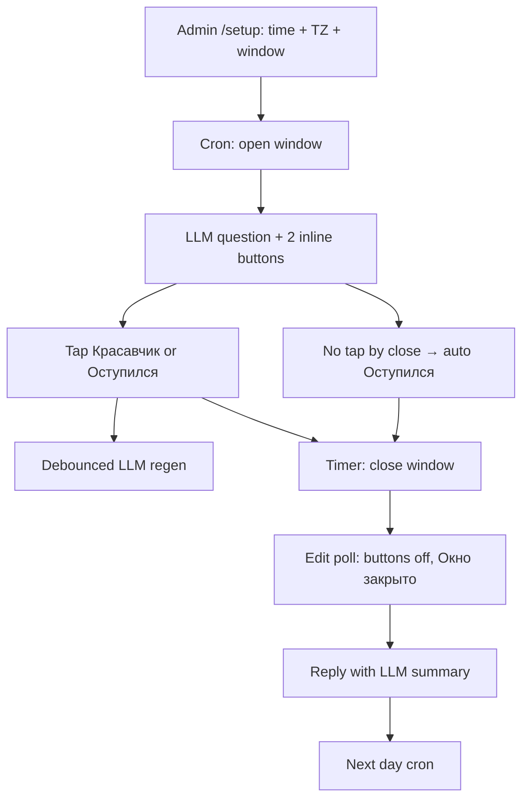

# Sushkabot — Product Spec

**Version:** 0.7.0 | **Changelog:** [`docs/changelog/SPEC.md`](changelog/SPEC.md) | **Deploy:** [`docs/DEPLOY.md`](DEPLOY.md)

Agent-ready product contract. Prompt text: [`src/prompts/system.md`](../src/prompts/system.md). Backlog: [`docs/IDEAS.md`](IDEAS.md).

---

## 1. Vision

Sushkabot gamifies abstinence from alcohol and substances in a Telegram friend group. Not a dry tracker: playful, surprising, organic in chat. All bot-facing copy is LLM-generated (Russian fallbacks when API key unset). Tone: in-group voice — sarcasm toward laziness and bragging, warmth on slips and comebacks. Not a coach or therapist.

Stateless runtime; SQLite durable state. One long-polling process + per-chat schedulers.

---

## 2. Core Mechanics

Read §1 + §2 to reimplement product logic without source code.

### 2.1 Daily loop



### 2.2 Buttons → status

Two fixed buttons for all chats. Callback prefix `checkin:`.

| Button | Callback | Base status |
|--------|----------|-------------|
| 💪 Красавчик | `krasavchik` | `sober` |
| 🍺 Оступился | `ostupilsya` | `minor_slip` (may escalate) |

No «Пидорнулся» button. `major_slip` only via escalation, grace gate, or legacy rows.

**Grace gate** (`chats.grace_min_sober_days`, default 7): «Оступился» / silence stores `minor_slip` only when sober streak **as of yesterday** ≥ threshold; otherwise `major_slip` (streak breaks). `0` = grace from first sober day (legacy).

**Resolution** (`resolveCheckinStatus`):

| Action | Condition | Stored status | Streak effect |
|--------|-----------|---------------|---------------|
| Красавчик | always | `sober` | +1 sober streak |
| Оступился | yesterday sober or no record; streak ≥ grace_min | `minor_slip` | Grace: streak preserved, day not counted |
| Оступился | yesterday sober or no record; streak < grace_min | `major_slip` | Sober streak broken |
| Оступился | yesterday `minor_slip` or `major_slip` | `major_slip` | Sober streak broken |
| Silence until close | joined member, no tap | same as Оступился | Grace gate applies |
| Re-tap while open | — | overwrites | recalc |

Legacy DB: `slip` → `major_slip`, `skipped` → `minor_slip` (`normalizeCheckinStatus`).

Fallback question (no LLM): `Оступился сегодня?`

### 2.3 Dual streaks

Computed from check-in history (up to 365 days), not stored.

**Sober streak** — walk backward from `asOfDate`:

| Day status | Effect |
|------------|--------|
| `sober` | +1, continue |
| `minor_slip` (single*) | not counted; streak unchanged; continue |
| `minor_slip` after previous slip day | break |
| `major_slip` | break |
| missing day | stop |

\*Previous calendar day was not a slip status.

**Intox streak** — consecutive slip days (`minor_slip` or `major_slip`) ending at `asOfDate`.

**Totals:** `totalSoberDays`, `totalSlipDays` — cumulative. Primary LLM metric when current streak is weak.

### 2.4 Streak quality (LLM layer)

Grace-heavy streaks can hit numeric milestones without «clean» sobriety.

| Field | Meaning |
|-------|---------|
| `quality: solid` | no grace days in streak window; `soberRatio14` ≥ 0.85 |
| `quality: grace-heavy` | ≥2 grace days in window OR `soberRatio14` < 0.7 |
| `quality: mixed` | otherwise |
| `pattern` | 14-char compact history: `K`=sober, `m`=minor, `M`=major, `-`=missing |
| `hollow_milestone` | hit 7/30/90 sober count but `quality` ≠ solid |

### 2.5 Highlight events

`detectTodayEvent()` for live LLM context:

| Event | When |
|-------|------|
| `extended_sober` | sober day extends streak |
| `grace_minor` | minor slip, sober streak preserved |
| `broke_sober` | sober streak broken (escalation or major) |
| `started_intox` / `extended_intox` | intox streak |
| `milestone_7/30/90` | solid sober milestone |
| `hollow_milestone` | numeric milestone but grace-heavy |
| `comeback` | sober after ≥2 intox days |
| `fresh_start` | first sober day |
| `near_milestone` | within 3 days of 7/30/90 |
| `routine` | nothing notable |

When `answeredCount > HIGHLIGHT_FULL_LIST_MAX`, live mode = `highlights_only` (non-routine only).

### 2.6 Code vs LLM

| Deterministic (code) | Generative (LLM) |
|---------------------|------------------|
| Callbacks, status resolution, streak math | Window open body |
| Cron open/close, auto `minor_slip` | Live regen after answers |
| Footer close time, button labels | Evening summary |
| Milestone detection | Personal `/stats` |
| Schedule, timezone in context | Tone, @mentions, chat weave |

LLM failure → keep prior body or static fallback; never crash.

### 2.7 Chat invariants

- Bot messages **not deleted** proactively (except optional `/stats` TTL)
- Summary **replies** to window message
- Window at close → edit in place, buttons removed, footer «Окно закрыто.»
- One window per chat per calendar day (`checkin_date` = open day in chat TZ)

### 2.8 Schedule invariants

- Cron: `{minute} {hour} * * *` in chat timezone
- Close: `window_opens_at + window_duration_minutes`
- LLM receives local `checkin_opens`, `window_closes` (local HH:mm), `timezone` — must not invent deadlines

---

## 3. Scope

### 3.1 In scope

- Settings wizard (`/setup`, `/config`): time, timezone, window duration
- Daily open/close window; two check-in buttons
- LLM: open, live, summary, `/stats` — shared context (schedule, snippets, roster+quality, style examples)
- Commands: `/stats`, `/board`, `/pledge`, `/rules`, `/help`; DM `/settings` timezone
- Mid-window nudge when `nudge_enabled` (50% of window elapsed)
- Milestone posts at 7/30/90 sober days on window close
- Dual streaks, streak quality, hollow milestones
- Chat snippets for LLM; `bot_posts` tracking; `/stats` ephemeral TTL
- Reaction + reply tracking on bot posts
- Dev: `/force_open`, `/force_close` when `BOT_ENV=development`
- Docker + GHCR deploy ([`DEPLOY.md`](DEPLOY.md))

### 3.2 Out of scope / future

| Feature | Notes |
|---------|-------|
| Configurable question/buttons | Fixed; legacy DB columns kept |
| `checkins.note` | Column unused |
| Personal TZ in scheduling | `timezone_override` stored, not applied to cron |
| Group weekly rollups | Phase 3 |
| Live countdown in footer | Stale after debounced edit; footer shows local close time only |
| Per-person window times | v2 |
| Contextual LLM replies to chat | Future |
| Webhook mode | Long polling only |
| LLM nudge/milestone copy | Static fallbacks today; Wave 2 |

---

## 4. Flows

### 4.1 Onboarding

Admin `/setup` or `/config` → inline wizard (one message, in-place edits). Defaults: 21:00, Europe/Moscow, 120 min window, grace after 7 sober days. Save registers scheduler. Question/buttons not configurable.

New member joins → welcome reply with same rules text as `/rules` (ephemeral TTL 4h). `/rules` → static rules text with chat check-in time when configured (ephemeral TTL 24h).

### 4.2 Check-in window

**Open:** insert/reuse `daily_windows`; LLM `generated_body`; post + buttons; schedule close (+ nudge at 50% if enabled).

**Answer:** validate open + before deadline; auto-join roster; resolve status; upsert checkin; debounced edit + LLM live regen (`LLM_DEBOUNCE_MS`).

**Close:** auto `minor_slip` for silent joined members; edit window (never delete); status `closed`; post summary as **reply** to window; optional milestone posts; status `summarized`.

**Message shape (window):**

```
{LLM body}

⏱ до {HH:mm} · {answered}/{joined} ответили
[ inline buttons ]
```

Closed: same body + «Окно закрыто.»; buttons removed.

### 4.3 Retention hooks

| Hook | Behavior |
|------|----------|
| `/pledge` | Once/day public commitment before evening window |
| `/board` | Group momentum (streaks ≥7, comebacks, total sober days) |
| Nudge | Mid-window ping if unanswered joined members |
| Milestone | Separate post when someone hits 7/30/90 sober on close |
| Live regen | Social accountability — who answered, who silent |

---

## 5. Commands

| Command | Where | Who | Behavior |
|---------|-------|-----|----------|
| `/setup` | Group | Admin | Wizard; draft until Save |
| `/config` | Group | Admin | Wizard; auto-save per field |
| `/stats` | Group | Anyone | Personal LLM stats; ephemeral TTL |
| `/board` | Group | Anyone | Group momentum board |
| `/pledge` | Group | Anyone | Daily commitment post |
| `/rules` | Group | Anyone | Static rules: two buttons, grace/escalation, milestones; ephemeral TTL 24h |
| `/help` | Anywhere | Anyone | Command list |
| `/settings` | DM | Anyone | Personal timezone picker |
| `/force_open` / `/force_close` | Group | Env admin | Dev only |

**Telegram requirements:** supergroup admin (delete for `/stats` TTL); Privacy Mode off; post + edit messages.

**Menu (`setMyCommands`):** group — stats, pledge, board, rules, join, leave, help; admins — + setup, config (+ dev force_open/close); DM — settings, help.

---

## 6. LLM

Prompt source of truth: [`src/prompts/system.md`](../src/prompts/system.md). Loaded at runtime; kind-specific task suffix in TS builders.

### 6.1 Task kinds

| Kind | Trigger | Output |
|------|---------|--------|
| `open` | Window open | 2–4 lines; check-in question |
| `live` | After answer debounce | 2–5 lines; rewrite invite + highlights |
| `summary` | Window close | 2–5 lines; full summary message |
| `stats` | `/stats` | 3–6 lines; personal stats |

### 6.2 Shared context blocks

Built by `buildLlmBaseContext()` + kind filters; trimmed by `trimContextToBudget()`:

| Block | Source | Notes |
|-------|--------|-------|
| Schedule | `chats` + window | timezone, checkin_opens, window_closes (local HH:mm), duration, grace_min_sober_days |
| Style examples | `llm_generations` | kind-filtered, limit `LLM_STYLE_EXAMPLES` |
| Chat snippets | `chat_snippets` | up to `LLM_CHAT_CONTEXT_COUNT`, trimmed per snippet |
| Roster | active members + streak quality | compact one-liners; live = unanswered + notable |
| Highlights | today checkins | live/summary only |
| Stats payload | personal history | `/stats` only |

Priority under budget: flow-specific → snippets → roster → style examples.

### 6.3 Provider

OpenAI-compatible API. Optional (`OPENAI_API_KEY`). Temperature 0.9, timeout 8s. DeepSeek: `thinking: disabled`. Debug logs at `LOG_LEVEL=debug`.

---

## 7. Data Model

SQLite via Drizzle. Telegram IDs as `text`.

**Core tables:** `chats`, `members`, `chat_members`, `daily_windows`, `checkins`, `bot_posts`, `chat_snippets`, `llm_generations`.

**`checkins.status`:** `sober` | `minor_slip` | `major_slip`

**`daily_windows.status`:** `open` → `closed` → `summarized`

**`bot_posts.kind`:** `window` | `summary` | `stats` | `command`

One check-in per member per window. Unique `(chat_id, checkin_date)` per window.

Migrations in `drizzle/*.sql`; auto on bot start.

---

## 8. Scheduling

| Level | Fields |
|-------|--------|
| Chat | `checkin_hour`, `checkin_minute`, `window_duration_minutes`, `timezone`, `enabled`, `nudge_enabled`, `grace_min_sober_days` |
| Person | `timezone_override` (display only, not cron) |

Window may cross midnight; `checkin_date` stays open day. Second cron same day: no-op if summarized.

---

## 9. Environment

| Variable | Default | Description |
|----------|---------|-------------|
| `BOT_TOKEN` | — | Required |
| `ADMIN_USER_IDS` | — | Required, comma-separated |
| `BOT_ENV` | `production` | `development` → force commands |
| `DATABASE_PATH` | `./data/sushkabot.db` | SQLite path |
| `LOG_LEVEL` | `info` | |
| `DEBOUNCE_MS` | `2000` | Telegram edit debounce |
| `LLM_DEBOUNCE_MS` | `6000` | Live LLM regen delay |
| `OPENAI_API_KEY` | — | Enables LLM |
| `OPENAI_API_BASE` | OpenAI URL | Compatible APIs |
| `OPENAI_MODEL` | `gpt-4o-mini` | |
| `LLM_CONTEXT_MAX_CHARS` | `6000` | Context budget |
| `LLM_CHAT_CONTEXT_COUNT` | `30` | Snippets sent (trimmed by budget) |
| `CHAT_SNIPPET_LIMIT` | `50` | DB ring buffer |
| `LLM_STYLE_EXAMPLES` | `5` | Style examples per kind |
| `STATS_TTL_MINUTES` | `30` | Ephemeral `/stats` |
| `HIGHLIGHT_FULL_LIST_MAX` | `5` | Full vs highlights_only |

See [`README.md`](../README.md) for dev setup.

---

## 10. Edge Cases

| Case | Expected |
|------|----------|
| Re-tap while open | Update checkin; LLM regen if highlights changed |
| Оступился after yesterday slip | `major_slip` |
| Оступился with streak < grace_min | `major_slip` |
| Silent at close | Same resolution as Оступился |
| Tap after deadline | Toast «Окно закрыто»; no write |
| Bot restart mid-window | Re-schedule close; no duplicate post |
| LLM timeout | Prior body or fallback |
| Summary post | Reply to window `message_id` |
| Alternating KmKmK pattern | `grace-heavy`; `hollow_milestone` not full celebration |
| `/stats` before TTL + reply | Kept (`has_reply`) |

---

## Appendix A — File Map

| Path | Role |
|------|------|
| `src/index.ts` | Boot, migrate, poll |
| `src/prompts/system.md` | LLM system prompt |
| `src/prompts/load-system.ts` | MD loader + kind suffix |
| `src/services/window.ts` | open/close window |
| `src/services/summary.ts` | LLM summary (reply) |
| `src/services/llm-context.ts` | Shared LLM context + schedule |
| `src/services/streak-quality.ts` | Pattern + quality metrics |
| `src/services/context-budget.ts` | Token budget trim |
| `src/services/streak.ts` | Streaks + highlight events |
| `src/services/llm.ts` | API client |
| `src/types.ts` | Buttons, statuses, resolution |
| `src/bot/handlers/` | grammY handlers |
| `docs/DEPLOY.md` | Ops runbook |
| `docs/changelog/SPEC.md` | Spec version history |
